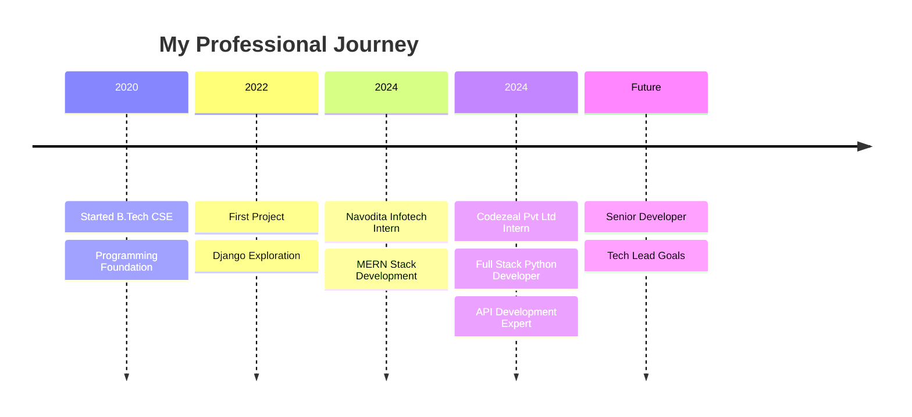

<div align="center">


</div>

<div align="center">

#  Hey Universe! I'm **Ashwini Ranjan Singh**


<div align="center">
  
  
  
</div>

<br>

<table align="center">
<tr>
<td align="center" width="50%">

</td>
<td align="center" width="50%">

### 🚀 Quick Stats
```json
{
  "name": "Ashwini Ranjan Singh",
  "location": "🌍 Ranchi, Jharkhand",
  "role": "Full Stack Developer",
  "experience": "2+ Years",
  "coffee_consumed": "∞ cups ☕",
  "bugs_created": "404 😅",
  "bugs_fixed": "∞ + 1",
  "current_status": "Building the future"
}
```

</td>
</tr>
</table>

</div>

---

<div align="center">

## 🎨 **Interactive Tech Stack Universe**


</div>

<details align="center">
<summary><b>🔥 Click to Explore My Complete Arsenal!</b></summary>

<div align="center">

### 💻 Programming Languages


### 🎨 Frontend Technologies  


### ⚙️ Backend Frameworks


### 🗄️ Databases & Storage


### ☁️ DevOps & Cloud


### 🛠️ Tools & IDEs


### 🤖 AI/ML & Data Science


</div>

<div align="center">

</div>

</details>

---

<div align="center">

## 📊 **GitHub Analytics Dashboard**


<br><br>


<br><br>


</div>

---

<div align="center">

## 🏆 **Achievement Showcase**


</div>

---

## 💼 **Professional Journey Timeline**

<div align="center">


</div>



<details>
<summary><b>📈 Expand My Professional Experience</b></summary>

<div align="left">

### 🚀 **Full Stack Python Developer Intern** 
**🏢 Codezeal Private Limited** | *📅 Feb 2024 – Aug 2024*
- 🎯 **Achievement**: Developed and maintained 5+ web applications using Django
- 🔐 **Security**: Implemented JWT authentication and secure API endpoints
- ⚡ **Performance**: Optimized database queries reducing response time by 40%
- 📊 **Impact**: Enhanced application performance serving 10K+ daily users
- 🛠️ **Tech Stack**: Django, PostgreSQL, Redis, Docker, AWS

### 💻 **Full-Stack Development Intern**
**🏢 Navodita Infotech** | *📅 Feb 2024 – Mar 2024*
- 🌐 **Frontend**: Built responsive React applications with modern UI/UX
- 🔧 **Backend**: Developed robust Node.js APIs with Express.js
- 📱 **Mobile-First**: Created responsive designs with 99% device compatibility
- 🚀 **Deployment**: Deployed applications on AWS with CI/CD pipelines
- 🛠️ **Tech Stack**: MERN Stack, Material-UI, AWS EC2

</div>

</details>

---

<div align="center">

## 🎯 **Featured Projects Showcase**


</div>

<div align="center">
<table>
<tr>
<td width="50%">

<div align="center">

</div>

**🛒 MERN E-Commerce Platform**
- 🎨 Modern React UI with Redux
- 🔐 JWT Authentication & Authorization  
- 💳 Stripe Payment Integration
- 📱 Fully Responsive Design
- ⚡ Real-time Notifications

</td>
<td width="50%">

<div align="center">

</div>

**🌐 Django Social Network**
- 👥 Real-time Chat System
- 📸 Image Upload & Processing
- 🔍 Advanced Search & Filtering
- 📊 Analytics Dashboard
- 🚀 RESTful API Design

</td>
</tr>
</table>
</div>

<div align="center">

### 🌟 **More Amazing Projects**

[](https://github.com/your-github-username/ai-chatbot)
[](https://github.com/your-github-username/task-manager)
[](https://github.com/your-github-username/weather-app)
[](https://github.com/your-github-username/portfolio)

</div>

---

<div align="center">

## 🚀 **Current Focus & 2024 Roadmap**


</div>

<table align="center">
<tr>
<td width="50%" valign="top">

### 🌱 **Currently Mastering**
- ☁️ **AWS Solution Architecture**
  - Lambda, API Gateway, DynamoDB
  - EC2, S3, CloudFormation
- 🤖 **Advanced AI/ML**
  - TensorFlow, PyTorch
  - Computer Vision, NLP
- 🔧 **DevOps Excellence** 
  - Kubernetes, Docker Swarm
  - Jenkins, GitHub Actions
- 📊 **Data Engineering**
  - Apache Kafka, Apache Spark
  - Data Pipelines, ETL

</td>
<td width="50%" valign="top">

### 🎯 **2024 Mission Goals**
- [x] Complete 2 Professional Internships
- [ ] **🏆 AWS Solutions Architect Certification**
- [ ] **🌟 Contribute to 10 Open Source Projects**
- [ ] **📚 Publish 20 Technical Blog Posts**
- [ ] **🚀 Build 5 Production-Ready Applications**
- [ ] **🎤 Speak at 2 Tech Conferences**
- [ ] **📈 Reach 1000 GitHub Followers**
- [ ] **💼 Land Full-Time Developer Role**

</td>
</tr>
</table>

---

<div align="center">

## 🎓 **Education & Certifications Hub**


</div>

<div align="center">

### 🏛️ **Academic Background**


### 🏅 **Professional Certifications**


### 🎯 **Upcoming Certifications**


</div>

---

<div align="center">

## 🎮 **Beyond Coding Universe**


</div>

<table align="center">
<tr>
<td align="center" width="25%">
  
  <br><strong>🧠 Problem Solving</strong>
  <br><sub>DSA • Competitive Programming</sub>
  <br>
</td>
<td align="center" width="25%">
  
  <br><strong>🏏 Sports Fanatic</strong>
  <br><sub>Cricket • Volleyball • Football</sub>
  <br>
</td>
<td align="center" width="25%">
  
  <br><strong>🔬 Tech Explorer</strong>
  <br><sub>Emerging Tech • Innovation</sub>
  <br>
</td>
<td align="center" width="25%">
  
  <br><strong>📚 Content Creator</strong>
  <br><sub>Tech Blogs • Tutorials</sub>
  <br>
</td>
</tr>
</table>

---

<div align="center">

## 🌐 **Connect & Collaborate**


</div>

<div align="center">

<a href="mailto:ashwiniranjansingh@gmail.com">
  
</a>
<a href="your-linkedin-profile-url">
  
</a>
<a href="your-github-profile-url">
  
</a>
<a href="your-twitter-profile-url">
  
</a>

<br><br>

<a href="your-portfolio-url">
  
</a>
<a href="your-resume-url">
  
</a>
<a href="your-blog-url">
  
</a>

</div>

---

<div align="center">

## 📈 **Real-Time Metrics**

### 💻 **Weekly Development Breakdown**
<!--START_SECTION:waka-->
<!--END_SECTION:waka-->

### 🎵 **Currently Listening To**


### 💭 **Daily Inspiration**


</div>

---

<div align="center">

## 🎨 **Fun Interactive Section**

<details>
<summary><b>🎲 Click for a Random Programming Joke!</b></summary>

<div align="center">

</div>

</details>

<details>
<summary><b>🐍 Watch My Contribution Snake!</b></summary>

<div align="center">

</div>

</details>

<details>
<summary><b>🏃‍♂️ My GitHub Metrics Dashboard!</b></summary>

<div align="center">

</div>

</details>

</div>

---

<div align="center">


<br>

**"The only way to do great work is to love what you do."** - *Steve Jobs* ✨

<br>


</div>
